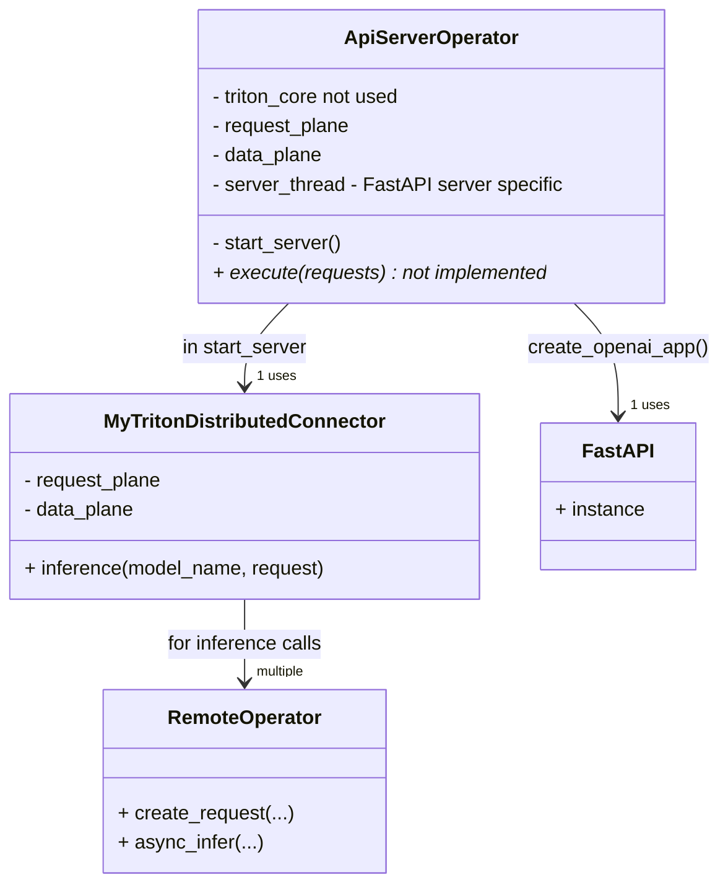
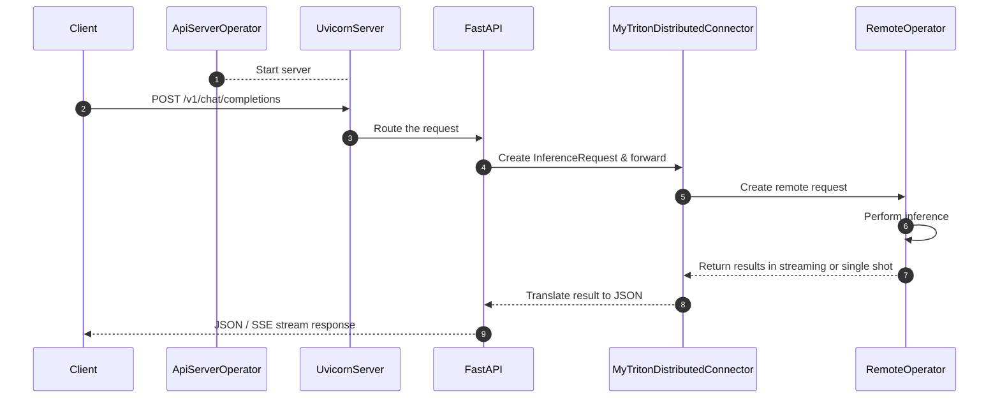
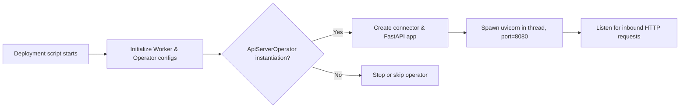

# Triton Distributed OpenAI-Compatible API Server Operator

This folder contains an example Operator (`ApiServerOperator`) that starts an OpenAI-compatible HTTP server within the Triton Distributed infrastructure. It allows sending requests in OpenAI’s format (e.g. `POST /v1/chat/completions`) while under the hood communicating with remote Triton Operators or Models via a request plane (NATS) and a data plane.

It serves as a reference for how you can bring your own specialized HTTP endpoints that conform to the OpenAI protocol and yet rely on the Triton distributed environment for inference calls.

## Contents

1. [Overview](#overview)
2. [Key Components](#key-components)
3. [Architecture Diagrams](#architecture-diagrams)
   1. [Class Diagram](#class-diagram)
   2. [Sequence Diagram](#sequence-diagram)
   3. [Flow Diagram](#flow-diagram)
4. [Running the Operator](#running-the-operator)
   1. [Deployment via `python -m deploy`](#deployment-via-python---m-deploy)
5. [Usage](#usage)
   1. [Example Endpoints](#example-endpoints)
   2. [Chat/Completions Examples](#chatcompletions-examples)


## Overview

- The `ApiServerOperator` (found in [`operators/api_server_operator.py`](operators/api_server_operator.py)) launches a `uvicorn` server in a background thread.
- That server uses the FastAPI application created by [`create_openai_app`](operators/server.py#L8), which wires up routes for:
  - Chat completions (`/v1/chat/completions`)
  - Completions (`/v1/completions`)
  - Health checks, model listing, version info, etc.
- Communication with the rest of the Triton distributed environment happens through a connector (`MyTritonDistributedConnector`), which transforms HTTP requests to asynchronous inference requests on a remote operator or model.

This design allows you to keep an OpenAI-compatible HTTP front end while distributing model inference, possibly across multiple GPU hosts, using the Triton distributed approach.


## Key Components

1. **`operators/api_server_operator.py`**
   Defines the `ApiServerOperator` class. When activated as part of a Worker, it starts up `uvicorn` on port 8080 to serve the HTTP endpoints.

2. **`operators/server.py`**
   Contains the `create_openai_app` function, which instantiates the FastAPI application. It imports utilities from a shared folder, `triton_api_server`, that implements the OpenAI endpoints.

3. **`operators/connector.py`**
   Implements `MyTritonDistributedConnector`, bridging the HTTP-level `InferenceRequest` objects to Triton Distributed’s `RemoteInferenceRequest`.

4. **`deploy/__main__.py`**
   Defines the deployment script. Spawns a Worker named `api_server` that runs `ApiServerOperator`. Usage example:
   ```bash
   python -m deploy
   ```
   See [Deployment via `python -m deploy`](#deployment-via-python---m-deploy) for more details.

5. **`tests/`**
   Contains test units for verifying the correctness of the endpoints and connectors.

6. **`api_endpoint/`**
   Contains the `triton_api_server` code that provides the OpenAI-compatible routes (e.g. `/v1/chat/completions`). This was originally copied from the main Triton Inference Server repository, adjusted for the distributed environment.


## Architecture Diagrams

### Class Diagram

Below is a simplified diagram highlighting the relationships between the main classes:



- **ApiServerOperator**
  Runs in a Triton distributed worker. On startup, it spawns a background thread that starts `uvicorn`.

- **FastAPI**
  The Python web framework that exposes the `/v1/chat/completions` and other endpoints.

- **MyTritonDistributedConnector**
  Implements logic to forward requests from HTTP to the Triton distributed environment using the request plane and data plane (NATS / other channels).

- **RemoteOperator**
  The “client” proxy for an operator running elsewhere in the cluster. It can create asynchronous inference requests (`RemoteInferenceRequest`) and send them into the request plane.

### Sequence Diagram

This diagram shows a typical request flow:



### Flow Diagram

Below is a diagram describing how the operator is started during deployment:



- **A**: The deployment script (`deploy/__main__.py`) is run.
- **B**: Triton Distributed initializes the Worker with the config for our operator (`ApiServerOperator`).
- **C**: The operator is instantiated.
- **D**: The operator sets up a connector and the underlying FastAPI application.
- **E**: A separate thread runs `uvicorn` to serve requests.
- **F**: The server is ready to accept requests (like `/v1/chat/completions`).

---

## Running the Operator

### Deployment via `python -m deploy`

This example code includes a minimal deployment configuration in [`deploy/__main__.py`](deploy/__main__.py).

1. Install dependencies (including `triton-distributed` packages or your custom fork).
2. Run:
   ```bash
   python -m deploy --clear-logs --log-level 1
   ```
   - `--clear-logs` will remove the log folder before starting
   - `--log-level` sets the verbosity.
3. Upon successful startup, the logs will show messages similar to:
   ```
   Starting uvicorn server for openai endpoints.
   INFO:     Uvicorn running on http://0.0.0.0:8080
   ```
   The server is now listening on port `8080`.


## Usage

When the operator is running, it listens on `http://0.0.0.0:8080` (by default).

### Example Endpoints

1. **Health Check**
   ```bash
   curl -X GET http://localhost:8080/v1/health/live
   curl -X GET http://localhost:8080/v1/health/ready
   ```
   **Response**
   ```json
   {
     "message": "Service is live."
   }
   ```
   or
   ```json
   {
     "message": "Service is ready."
   }
   ```

2. **List Models**
   ```bash
   curl -X GET http://localhost:8080/v1/models
   ```
   **Sample Response**
   ```json
   {
     "object": "list",
     "data": [
       {
         "id": "gpt-3.5-turbo",
         "object": "model",
         "created": 0,
         "owned_by": "triton"
       }
     ]
   }
   ```

### Chat/Completions Examples

- **Chat Completions** (similar to OpenAI)
  ```bash
curl -X POST http://localhost:50000/v1/chat/completions \
    -H 'Content-Type: application/json' \
    -d '{
      "model": "gpt-3.5-turbo",
      "messages": [{"role":"user","content":"Hello Triton!"}],
      "stream": false
    }'  ```
  **Sample Response**
  ```json
  {
    "id": "chatcmpl-123",
    "object": "chat.completion",
    "created": 1692751723,
    "model": "gpt-3.5-turbo",
    "system_fingerprint": null,
    "choices": [
      {
        "index": 0,
        "message": {
          "role": "assistant",
          "content": "Hello from your Triton-based AI!"
        },
        "finish_reason": "stop",
        "logprobs": null
      }
    ]
  }
  ```

- **Completions** (non-chat style)
  ```bash
  curl -X POST http://localhost:8080/v1/completions \
    -H 'Content-Type: application/json' \
    -d '{
      "model": "completion_model",
      "prompt": "Write a short poem about the sea."
    }'
  ```
  **Sample Response**
  ```json
  {
    "id": "cmpl-123",
    "object": "text_completion",
    "created": 1692751723,
    "model": "completion_model",
    "choices": [
      {
        "text": "Write a short poem about the sea.\n\nOcean whispers...",
        "index": 0,
        "finish_reason": "stop",
        "logprobs": null
      }
    ]
  }
  ```
