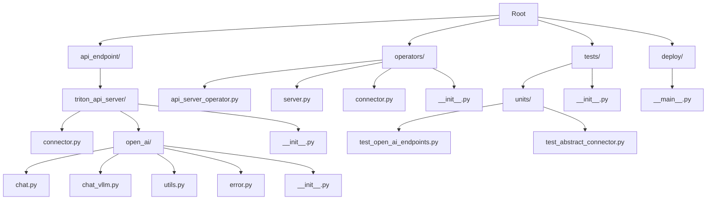
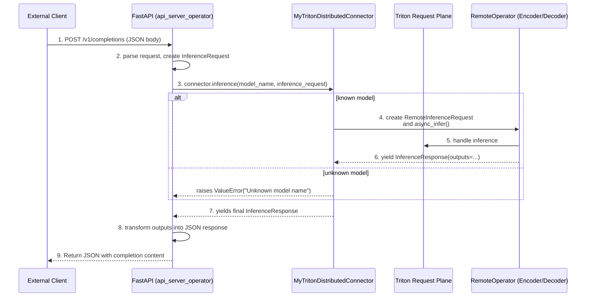
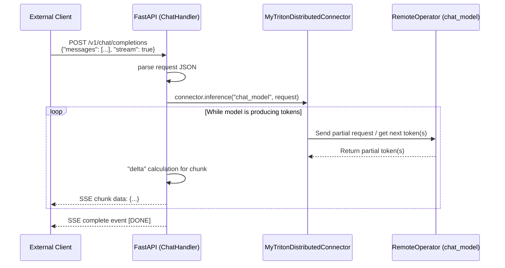

Below is a step-by-step description of the code you are proposing, along with some observations on its structure and potential usage scenarios. The overarching goal seems to be integrating a FastAPI-based OpenAI-style API server with Triton Distributed operators for inference, while preserving or adapting code previously found in a “Triton 3.0” repository. This results in two major code groupings:

1. **`api_endpoint`** directory: Contains the logic for hosting OpenAI-compatible endpoints using FastAPI, including request/response schemas, streaming responses, and interfacing with a Triton-based connector (the “vLLM” chat code appears to come from a separate or older repository).  
2. **`operators`** directory: Defines custom Triton Distributed operators (e.g., `ApiServerOperator`) that run in parallel or cluster-managed contexts, bridging your distributed request plane/data plane logic with the “Triton 3.0” styled API code.  

Below is a high-level breakdown of each relevant file and its role.

---

## `operators` Directory

### `__init__.py`

- Exports the `EncodeDecodeOperator` from `hello_world.operators.encoder_decoder`.
- This is presumably a sample operator that performs some demonstration of an “encode + decode” pipeline.

### `operators/server.py`

- Shows a simple FastAPI creation function, `create_openai_app()`, that wraps `create_app(...)` from `triton_api_server.open_ai.server`.
- Illustrates how to inject a custom connector (`MyTritonDistributedConnector`) into the `create_app(...)` function.  
- The final result is a FastAPI application object that can be run either directly or via Uvicorn.

### `operators/api_server_operator.py`

- Defines `ApiServerOperator`, a subclass of `Operator` from `triton_distributed.worker`.
- Main purpose:
  - Create the FastAPI app via `create_openai_app`.
  - Start a Uvicorn server in a background thread on `start_server()`.
  - Ignore direct `RemoteInferenceRequest` messages (i.e., `execute` does not handle typical inference). Requests are only handled via the HTTP endpoints.
- This pattern is typical in Triton Distributed if you want to host a REST or WebSocket server as part of the Triton cluster, rather than having purely model inference operators.

### `operators/connector.py`

- Implements `MyTritonDistributedConnector`, deriving from `BaseTriton3Connector`.
- Acts as a bridge to Triton Distributed’s “request plane” and “data plane.”
- Key flow:
  - `inference(...)` constructs a `RemoteOperator` with the same name as the requested `model_name`.
  - Creates a request for that operator, possibly sending asynchronous streaming responses.
  - Yields `InferenceResponse` objects back to the FastAPI routes to be returned to the end user.
- This is effectively the “glue” between your custom “Triton 3.0 style” code and the new distributed engine.  

### `deploy/__main__.py`

- Illustrates how to define the Triton worker configurations (e.g., `encoder`, `decoder`, `encoder_decoder`, `api_server`).
- Adds them to a `Deployment` object with desired concurrency/replica counts.
- Calls `deployment.start()` to spin up the distributed system, including the new `api_server` operator.

---

## `tests` Directory

Your testing strategy uses `pytest` fixtures that spin up an `AsyncClient` with `ASGITransport` (from `httpx`), allowing direct calls to the FastAPI routes without network overhead. Some highlights:

- **`test_open_ai_endpoints.py`**:  
  - Mocks out a `BaseTriton3Connector` to simulate different model responses (`get_license`, `get_metadata`, etc.).  
  - Tests “OpenAI-like” endpoints such as `/v1/license`, `/v1/metadata`, `/v1/version`, health checks, etc.  
  - Verifies streaming and non-streaming completions.  
  - Contains additional mocking of tokenization/detokenization, ensuring your code can be tested without actual large-model dependencies.  
- **`test_abstract_connector.py`**:  
  - Demonstrates that a simple `MockConnector` can be used in place of the real `BaseTriton3Connector`.  
  - Good example of how a shared interface allows flexible swapping of connectors for testing or real runs.

---

## `api_endpoint` Directory

This folder seems largely copied or adapted from a “Triton 3.0” repository or similar codebase. It contains:

### `triton_api_server/connector.py`

- Declares abstract classes for a “Triton 3.0” system, defining:
  - `InferenceRequest`, `InferenceResponse` data classes.
  - The `BaseTriton3Connector` ABC that must implement an async `inference(...)` method.
- Also includes an optional `list_models(...)` method for enumerating available models in the system.

### `triton_api_server/open_ai` Subdirectory

Contains modules that replicate or adapt OpenAI’s ChatCompletion/Completions API patterns:

1. **`error.py`**  
   - Defines an `ErrorResponse` pydantic model for structured error messages.  

2. **`chat.py`**  
   - Implements the main Chat logic for single and streaming completions:
     - `create_chat_response(...)` for non-streaming responses.
     - `create_chunk_responses(...)` for chunked streaming responses with SSE-like output.  
   - Defines a `ChatHandler` that orchestrates request processing (`process_request(...)`), bridging from a `CreateChatCompletionRequest` to the underlying inference calls.  
   - Manages prompt manipulation, role, and chunk-based streaming.  

3. **`chat_vllm.py`**  
   - Extends `ChatHandler` as `ChatHandlerVllm` to handle vLLM specifics (tokenization, sampling parameters).  
   - `translate_chat_inputs(...)` merges request fields into a “sampling_params” dictionary.  
   - `translate_chat_outputs(...)` handles the final translation from inference output to your ChatCompletion schemas.  

4. **`utils.py`**  
   - Helper for converting numpy tensors to/from JSON (`tensor_to_json` and `json_to_tensor`).  
   - A `verify_headers(...)` function for validating request headers in FastAPI.  

This portion of the code is fairly standard for building an OpenAI-compatible endpoint on top of a custom inference backend, focusing on advanced chat semantics (e.g., streaming chunks, role-based conversation).

---

## Notable Observations and Opinions

1. **Clear Separation of Concerns**  
   - Having the “operators” code purely define how to spin up a server inside Triton Distributed (with custom connectors) is a sensible approach.  
   - Reusing or wrapping the “Triton 3.0” style OpenAI-like code under `api_endpoint` keeps the chat API logic decoupled from the cluster orchestration logic.

2. **Connector Pattern**  
   - The `BaseTriton3Connector` / `RemoteOperator` approach provides a flexible middle layer. In practice, this means any new operator or specialized pipeline can be swapped in as long as it respects the same method signatures.

3. **Testing and Mocking**  
   - The test suite shows a pattern of thoroughly mocking each layer—this is beneficial in distributed or HPC-like settings since standing up the entire environment repeatedly can be costly.

4. **Potential Improvements**  
   - Some repeated logic for streaming vs non-streaming completions in `chat.py` and `chat_vllm.py` can be refactored or consolidated.  
   - The “delta” detection logic (previous output vs new output) might become more complex with real multi-turn chat or partial streaming of tokens. A robust approach would handle chunk boundaries gracefully.  
   - Logging and tracing could be expanded to record request-plane vs data-plane events in more detail, especially if debugging distributed concurrency or performance.

5. **Deployment Flow**  
   - The code in `deploy/__main__.py` is concise but might need further modularization if you have multiple services or large sets of operator definitions. For bigger deployments, you might also consider dynamic operator loading.

Overall, this codebase provides a straightforward bridging solution between your “Triton 3.0” style Chat/Completion server (using FastAPI + OpenAI-like endpoints) and the new Triton Distributed environment. The design is modular and testable, with clear extension points for different models or advanced pipelines. By retaining the “Triton 3.0” logic in the `api_endpoint` folder, you avoid rewriting established code while introducing new distributed operator patterns in `operators`.

It should work well for an environment where multiple specialized operators (e.g., separate encoder/decoder, new chat pipeline, or custom embeddings) are orchestrated by the Triton worker system, while an external or internal user can simply send requests via OpenAI-like endpoints.

## 1. Directory Structure Diagram

This diagram can illustrate the high-level layout of folders and key files within the repo. It helps newcomers see at a glance which folders do what.

**Highlights**:

- **`api_endpoint/triton_api_server`**: Contains the base classes (`BaseTriton3Connector`), OpenAI-style endpoint logic (`open_ai/`), plus supporting modules (tokenization, error handling, chat streaming).
- **`operators`**: Houses custom operators, including an API Server operator that spawns Uvicorn and connectors bridging to Triton Distributed.
- **`tests`**: Contains various unit tests, including mock-based tests of the OpenAI endpoints and connector logic.
- **`deploy`**: Provides a `__main__.py` to define `Deployment` configurations for your Triton Distributed cluster.

---

## 2. High-Level Request Flow

This sequence diagram illustrates a **non-streaming** request from a client to the running system. It shows how a user request is handled by FastAPI, the operator’s connector, and the remote operator for inference.

**Key Points**:

- **`api_server_operator`** receives HTTP requests and constructs the `InferenceRequest`.  
- **`MyTritonDistributedConnector`** sends the request to a `RemoteOperator` (like `encoder_decoder`) via Triton’s request plane.  
- The operator processes or delegates the inference, returns results, which are turned into an OpenAI-style response.

---

## 3. Streaming Chat Flow

This diagram focuses on the **streaming** endpoints, where partial responses are sent chunk by chunk (Server-Sent Events or chunked responses).

