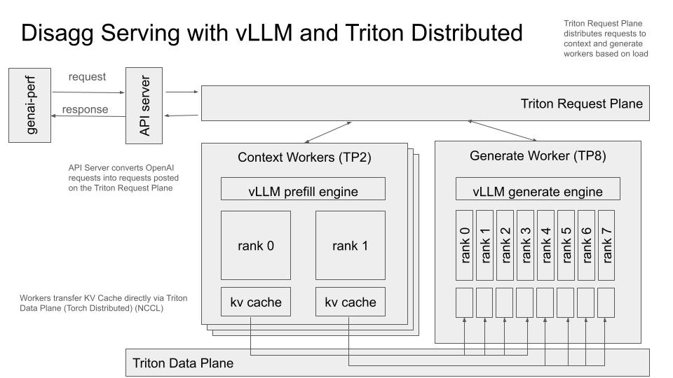

<!--
SPDX-FileCopyrightText: Copyright (c) 2024-2025 NVIDIA CORPORATION & AFFILIATES. All rights reserved.
SPDX-License-Identifier: Apache-2.0

Licensed under the Apache License, Version 2.0 (the "License");
you may not use this file except in compliance with the License.
You may obtain a copy of the License at

http://www.apache.org/licenses/LICENSE-2.0

Unless required by applicable law or agreed to in writing, software
distributed under the License is distributed on an "AS IS" BASIS,
WITHOUT WARRANTIES OR CONDITIONS OF ANY KIND, either express or implied.
See the License for the specific language governing permissions and
limitations under the License.
-->

# Disaggregated Serving

An example of disaggregated serving[^1] deployment using Triton Distributed and vLLM engines. In this example, you can deploy the OpenAI compatible API server and multiple prefill and decode workers.

In this deployment prefill and decode stages are decoupled and performed by different engines. This allows separate resource allocation and parallelism strategies for each of the two stages.


*Overview of disaggregated serving deployment architecture.*

For more details on triton distributed workflow please see the [Hello World example](../../hello_world/).

## Building the Environment

The example is designed to be deployed in a containerized
environment. It require access to at least two GPU devices.

To get started build the vLLM triton distributed development
environment.

```
./container/build.sh --framework VLLM
```

## Starting the Deployment

#### API server

```
<fill the command>
```

#### Prefill worker

```
CUDA_VISIBLE_DEVICES=0 VLLM_WORKER_ID=0 python3 -m examples.vllm.deploy --context-worker-count 1 --nats-url nats://localhost:4223 --model-name neuralmagic/Meta-Llama-3.1-8B-Instruct-FP8 --kv-cache-dtype fp8 --dtype auto --log-level INFO --worker-name llama --disable-async-output-proc --disable-log-stats --max-model-len 32768 --max-batch-size 10000 --gpu-memory-utilization 0.9 --context-tp-size 1 --generate-tp-size 1
```

#### Decode worker

```
CUDA_VISIBLE_DEVICES=0 VLLM_WORKER_ID=0 python3 -m examples.vllm.deploy --generate-worker-count 1 --nats-url nats://localhost:4223 --model-name neuralmagic/Meta-Llama-3.1-8B-Instruct-FP8 --kv-cache-dtype fp8 --dtype auto --log-level INFO --worker-name llama --disable-async-output-proc --disable-log-stats --max-model-len 32768 --max-batch-size 10000 --gpu-memory-utilization 0.9 --context-tp-size 1 --generate-tp-size 1
```

> [!NOTE]
> The FP8 variant of the Llama 3.1 model `neuralmagic/Meta-Llama-3.1-8B-Instruct-FP8`
> is chosen above to reduce the size of the data transfer in KV Cache movements.
> Only GPUs with Compute Capability >= 8.9 can use FP8. For older GPUs, try
> using a standard BF16/FP16 precision variant of the model such as
> `meta-llama/Meta-Llama-3.1-8B-Instruct`.

## Sending Requests

```bash
# localhost:8005 is the default, but should be changed based on server deployment args.
curl localhost:8005/v1/chat/completions \
  -H "Content-Type: application/json" \
  -d '{
    "model": "llama",
    "messages": [
      {"role": "system", "content": "What is the capital of France?"}
    ],
    "temperature": 0, "top_p": 0.95, "max_tokens": 25, "stream": true, "n": 1, "frequency_penalty": 0.0, "stop": []
  }'
```

## Benchmarking

OpenAI endpoint can be used for benchmarking using [GenAI-Perf tool](https://github.com/triton-inference-server/perf_analyzer/blob/main/genai-perf/README.md).

```
genai-perf profile \
-m llama \
--url <first slurm node for the job running server>:8005 \
--endpoint-type chat \
--streaming \
--num-dataset-entries 1000 \
--service-kind openai \
--endpoint v1/chat/completions \
--warmup-request-count 10 \
--random-seed 123 \
--synthetic-input-tokens-stddev 0 \
--output-tokens-stddev 0 \
--tokenizer neuralmagic/Meta-Llama-3.1-70B-Instruct-FP8 \
--synthetic-input-tokens-mean 3000 \
--output-tokens-mean 150 \
--extra-inputs seed:100 \
--extra-inputs min_tokens:150 \
--extra-inputs max_tokens:150 \
--profile-export-file my_profile_export.json \
--artifact-dir artifacts/ \
--concurrency 32 \
--request-count 320 \
-- -v \
--async
```

## vLLM patch

This example requires some additional features in vLLM engines. For the time being, those features are patched inside the container. The contents of the patch can be found [here](../../../container/deps/vllm/). Current patch is combatible with vLLM 0.6.3post1 release.

## Known issues

- Number of prefill and decode workers must be fixed at the start of the deployment.
- KV transfer might cause OOM errors if there are not enough space to receive the KV cache.
- KV cache preemption is not supported.

[^1]: Yinmin Zhong, Shengyu Liu, Junda Chen, Jianbo Hu, Yibo Zhu, Xuanzhe Liu, Xin Jin, and Hao
Zhang. Distserve: Disaggregating prefill and decoding for goodput-optimized large language
model serving. *arXiv:2401.09670v3 [cs.DC]*, 2024.